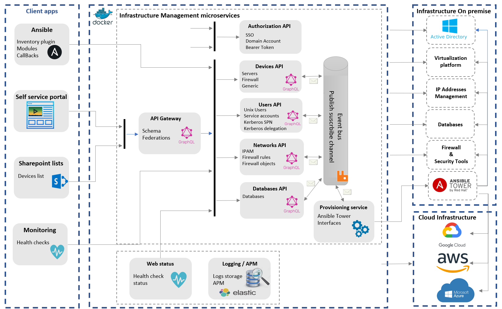

  

    Table of contents
  

  {: .text-delta }
1. TOC
{:toc}

## Goals

Implement an infrastructure inventory across all datacenters either on premise or in the cloud. This application will contain the expected state of all resources for an entreprise. It can be consumed by provisioning tools to automate the resources deployment and configuration.

This inventory is built by following a microservice architectural style. It is a main block of the [Devops platform](https://ygo74.github.io/).

This repository has the following goals:

- Build an application with dotnet based on a microservice pattern
- Deploy the application in a Kubernetes platform
- Provide a set of guidelines to develop and deploy a dotnet application

## Dynamic Inventory presentation

## Application status

- [Application url](https://inventory.francecentral.cloudapp.azure.com/configuration/graphql)
- 
- 

| Service | Build status | Tests status | Code coverage | Deployment status |
|:------- |:------------:|:------------:|:-------------:|:-----------------:|
| Configuration |  |  |  | |
| Devices |  |  |  | |
| Gateway |  |  |  | |

## Resources

- <https://learn.microsoft.com/en-us/azure/architecture/microservices/>{:target="_blank"}
- <https://learn.microsoft.com/en-us/azure/architecture/microservices/model/domain-analysis>{:target="_blank"}
